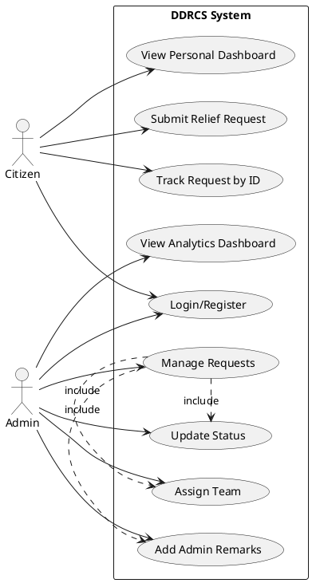
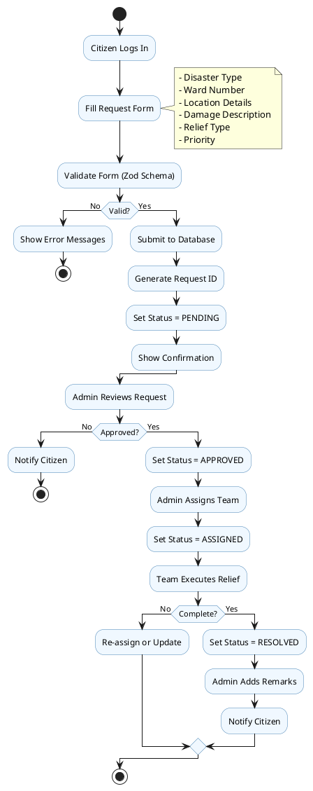

# DDRCS: Disaster Relief Request Coordination System

**A Project Report Submitted in Partial Fulfillment of the Requirements for the Degree of Bachelor of Science in Computer Science**

---

## Table of Contents

1. [Abstract](#1-abstract)
2. [Introduction](#2-introduction)
3. [Problem Statement](#3-problem-statement)
4. [Objectives](#4-objectives)
5. [E-Governance Context (Nepal)](#5-e-governance-context-nepal)
6. [System Design](#6-system-design)
7. [Conclusion](#7-conclusion)
8. [References](#8-references)
9. [Appendices](#9-appendices)

---

## 1. Abstract

The Disaster Relief Request Coordination System (DDRCS) is a web-based e-governance application designed to digitize disaster relief request management in Nepal. Built using TanStack Start, React, Supabase, and TypeScript, the system enables citizens to submit relief requests online and track their status in real-time. The application supports multiple disaster types (floods, earthquakes, landslides, fires) with a comprehensive workflow routing requests from submission through approval, assignment, and resolution. Administrators access an analytics dashboard providing insights into request patterns. By implementing e-governance principles of transparency and accountability, DDRCS contributes to Nepal's Digital Nepal Framework objectives.

**Keywords:** Disaster Management, E-Governance, Relief Coordination, Web Application, Nepal

---

## 2. Introduction

Nepal is among the world's most disaster-prone countries, facing recurring natural disasters including floods, landslides, earthquakes, and fires. The 2015 Gorkha Earthquake (7.8 magnitude) resulted in approximately 9,000 deaths [1] and exposed significant weaknesses in disaster response coordination, particularly the absence of systematic methods for affected populations to request relief assistance.

DDRCS is a web application developed to address these gaps. The system provides two user roles: citizens who submit and track relief requests, and administrators who manage the request workflow and access analytical insights. The platform digitizes the entire relief request lifecycle while maintaining transparency through real-time status updates.

---

## 3. Problem Statement

Nepal's disaster relief management faces several systemic challenges:

**Manual Processes:** Most municipalities rely on paper-based systems that are inefficient, error-prone, and difficult to maintain.

**No Real-Time Tracking:** Citizens cannot track their relief requests, creating uncertainty and eroding trust in public institutions.

**Delayed Response:** Without automated prioritization, critical cases may be delayed while resources go to less urgent situations.

**Lack of Transparency:** Citizens cannot verify if requests have been received or acted upon, creating opportunities for bias and corruption.

**Limited Data for Decisions:** Authorities lack comprehensive data on disaster patterns and relief needs for evidence-based planning.

---

## 4. Objectives

### Primary Objectives

1. **Digital Submission:** Enable citizens to submit relief requests through a digital platform capturing disaster type, location, damage details, and relief requirements.

2. **Real-Time Tracking:** Provide citizens the ability to track request status using unique identifiers.

3. **Administrative Management:** Equip administrators with tools to manage requests and access analytics on disaster patterns.

4. **Transparent Governance:** Establish clear status indicators and audit trails promoting accountability.

---

## 5. E-Governance Context (Nepal)

### 5.1 The 2015 Gorkha Earthquake

On April 25, 2015, a 7.8 magnitude earthquake struck Nepal with its epicenter in Barpak, Gorkha district. According to the Government of Nepal's Post Disaster Needs Assessment (PDNA), the earthquake resulted in nearly 9,000 lives lost, over 22,000 injured, and destruction of more than 500,000 houses [1]. The disaster affected 31 of Nepal's 75 districts, with total damages and losses estimated at US$7.1 billion [2].

The earthquake revealed critical coordination weaknesses:

- **Coordination Gaps:** Multiple agencies operated without centralized coordination, leading to duplication of efforts in some areas and neglect in others
- **Information Asymmetry:** Authorities lacked reliable data on affected populations and relief needs
- **Documentation Challenges:** Paper-based records were lost or damaged, complicating beneficiary verification

Remote villages in Dolakha, Sindhupalchok, and Nuwakot waited weeks for relief assistance [2].

### 5.2 Nepal Disaster Risk Management Act 2019

Learning from the 2015 experience, Nepal enacted the Disaster Risk Reduction and Management Act in 2076 BS (2019) [3]. Key provisions include:

- **National Disaster Management Authority (NDMA):** Apex body for disaster management responsible for policy formulation, coordination, and oversight
- **Information Management Systems:** The Act mandates disaster information management systems at federal, provincial, and local levels for collecting, processing, and disseminating disaster information
- **Local Disaster Management Committees:** Requires municipalities to establish committees and maintain disaster information systems
- **Accountability Provisions:** Requirements for documenting relief distribution and making information accessible to the public

DDRCS directly addresses these legislative requirements.

### 5.3 Digital Nepal Framework

The Government of Nepal's Digital Nepal Framework (2019) outlines a comprehensive vision for digital transformation using a "1-8-80" model: one country, eight priority sectors, and 80 digital initiatives [4]. Key objectives aligned with DDRCS:

- **Citizen-Centric Service Delivery:** Delivering government services through accessible digital channels
- **Transparency and Accountability:** Creating audit trails and enabling public access to information
- **Data-Driven Governance:** Evidence-based decision-making supported by data analytics

The framework specifically identifies disaster management systems under Urban Infrastructure as a priority initiative [4].

---

## 6. System Design

### 6.1 Architecture Overview

DDRCS follows a three-tier architecture:

- **Presentation Tier:** React-based UI with server-side rendering via TanStack Start, styled with Tailwind CSS
- **Application Tier:** TanStack Start server functions handling business logic and API endpoints
- **Data Tier:** Supabase PostgreSQL database with built-in authentication and row-level security

### 6.2 Use Case Diagram



**Use Case Descriptions:**

| Use Case | Actor | Description |
|----------|-------|-------------|
| Login/Register | Citizen, Admin | Authenticate via email/password or magic link |
| Submit Relief Request | Citizen | Create request with disaster type, location, damage, relief details |
| Track Request by ID | Citizen | View status and history using unique ID |
| View Personal Dashboard | Citizen | Access list of submitted requests |
| Manage Requests | Admin | View, filter, and manage all requests |
| Update Status | Admin | Change status (pending → approved → assigned → resolved) |
| Assign Team | Admin | Designate response team |
| View Analytics Dashboard | Admin | Access disaster pattern statistics |
| Add Admin Remarks | Admin | Attach administrative notes |

### 6.3 Activity Diagram



### 6.4 Request Workflow

Requests progress through four statuses:

| Status | Description |
|--------|-------------|
| **Pending** | Initial status, awaiting administrative review |
| **Approved** | Request validated, relief provision authorized |
| **Assigned** | Response team designated |
| **Resolved** | Request successfully addressed and closed |

### 6.5 Database Schema

**Profiles Table:**

| Column | Type | Description |
|--------|------|-------------|
| id | UUID | Primary key |
| full_name | VARCHAR | User's full name |
| role | ENUM | 'citizen' or 'admin' |
| created_at | TIMESTAMP | Account creation time |

**Relief Requests Table:**

| Column | Type | Description |
|--------|------|-------------|
| id | UUID | Primary key |
| citizen_id | UUID | Foreign key to profiles |
| disaster_type | ENUM | flood, earthquake, landslide, fire |
| ward_number | INT | Municipal ward (1-35) |
| location_details | TEXT | Detailed location |
| damage_description | TEXT | Description of damages |
| relief_type | ENUM | food, medical, shelter, evacuation |
| priority | ENUM | low, medium, high, critical |
| status | ENUM | pending, approved, assigned, resolved |
| assigned_team | VARCHAR | Assigned response team |
| admin_remark | TEXT | Administrative notes |
| created_at | TIMESTAMP | Submission time |
| updated_at | TIMESTAMP | Last modification |

---

## 7. Conclusion

### 7.1 Summary

DDRCS successfully demonstrates how digital platforms can address gaps in disaster management. The system achieves its objectives of enabling digital request submission, real-time tracking, administrative management, and transparent governance. Alignment with the Disaster Risk Management Act 2019 and Digital Nepal Framework positions DDRCS as a practical implementation of national policy.

### 7.2 Limitations

- **Internet Dependency:** Requires connectivity, potentially excluding remote populations
- **Digital Literacy:** Users with limited technical skills may face challenges
- **Language Support:** Currently English-only, limiting accessibility
- **Integration Gaps:** Operates independently without SMS or government system integration

### 7.3 Future Scope

- **SMS Integration:** For users without internet access
- **GIS Mapping:** Visual request mapping for better resource planning
- **Mobile Application:** Native apps with offline capabilities
- **Multilingual Support:** Nepali language interface
- **Inter-agency Integration:** Coordinated multi-agency response

---

## 8. References

[1] Government of Nepal, National Planning Commission. (2015). *Nepal Earthquake 2015: Post Disaster Needs Assessment, Vol. A: Key Findings.* Kathmandu.  
**URL:** https://www.worldbank.org/content/dam/Worldbank/document/SAR/nepal/PDNA%20Volume%20A%20Final.pdf

[2] PreventionWeb. (2021). *Nepal: Gorkha Earthquake 2015.* UNDRR.  
**URL:** https://www.preventionweb.net/collections/nepal-gorkha-earthquake-2015

[3] Government of Nepal. (2019). *Disaster Risk Reduction and Management Act, 2076 (2019).* Ministry of Home Affairs.  
**URL:** https://disasterlaw.ifrc.org/sites/default/files/media/disaster_law/2021-12/DRMCC%20Act%202019.pdf

[4] Government of Nepal, Ministry of Communication and Information Technology. (2019). *Digital Nepal Framework: Unlocking Nepal's Growth Potential.* Kathmandu.  
**URL:** https://www.digitaldevelopment.org/wp-content/uploads/2023/09/bEN_Digital_Nepal_Framework_V7.2March2019-1.pdf

[5] DPNet Nepal. (2019). *Nepal Disaster Report 2019.* Ministry of Home Affairs.  
**URL:** https://dpnet.org.np/uploads/files/Nepal%20Disaster%20Report%202019%202019-11-06%2004-39-35.pdf

[6] Government of Nepal. (2019). *National Position Paper on Disaster Risk Reduction and Management.* Global Platform for Disaster Risk Reduction, Geneva.  
**URL:** http://drrportal.gov.np/uploads/document/1514.pdf

[7] PlantUML. (2024). *PlantUML: Create UML diagrams quickly and easily.*  
**URL:** https://plantuml.com/

---

## 9. Appendices

### Appendix A: Technology Stack

| Category | Technology | Version |
|----------|------------|---------|
| Frontend | React | 19.2.0 |
| Framework | TanStack Start | 1.132.0 |
| Styling | Tailwind CSS | 4.1.18 |
| Charts | Recharts | 3.7.0 |
| Validation | Zod | 4.3.6 |
| Backend | Supabase | 2.97.0 |
| Language | TypeScript | 5.7.2 |
| Testing | Vitest | 3.0.5 |

### Appendix B: Project Structure

```
ddrrcs/
├── src/
│   ├── components/       # Reusable UI components
│   ├── hooks/            # Custom React hooks
│   ├── routes/           # File-based routing
│   │   ├── admin/        # Admin dashboard and analytics
│   │   ├── dashboard/    # Citizen dashboard
│   │   ├── submit/       # Request submission
│   │   └── track/        # Request tracking
│   ├── schemas/          # Zod validation schemas
│   ├── server/           # Server functions
│   └── types/            # TypeScript definitions
├── package.json
└── tsconfig.json
```

### Appendix C: Data Types (TypeScript)

```typescript
export type DisasterType = 'flood' | 'earthquake' | 'landslide' | 'fire'
export type ReliefType = 'food' | 'medical' | 'shelter' | 'evacuation'
export type Priority = 'low' | 'medium' | 'high' | 'critical'
export type Status = 'pending' | 'approved' | 'assigned' | 'resolved'
export type UserRole = 'citizen' | 'admin'
```

---

*End of Report*